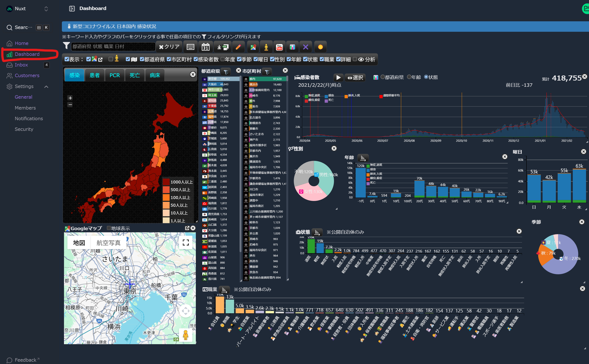

# Nuxt (Unovis|📊Dimensional chart) Dashboard Template with Nuxt UI Pro

Get started with the Nuxt 3 dashboard template with multiple pages, collapsible sidebar, keyboard shortcuts, light & dark more, command palette and more, powered by the [Nuxt UI Pro](https://ui.nuxt.com/getting-started/installation/pro/nuxt) UI Library.

- There are two types of dashboards:

## 1. Dashboard with [unovis](https://unovis.dev/)
[Live Demo](https://dashboard-template.nuxt.dev)

<a href="https://dashboard-template.nuxt.dev" target="_blank">
  <picture>
    <source media="(prefers-color-scheme: dark)" srcset="https://github.com/user-attachments/assets/57f6d964-a76c-4662-96b2-17622fb18d40">
    <source media="(prefers-color-scheme: light)" srcset="https://github.com/user-attachments/assets/c4c87f77-d10a-4731-9b7c-0cd0ff4821d7">
    
  </picture>
</a>


## 2. Dashboard with 📊[Dimensional chart](http://dc-js.github.io/dc.js/)
[Live demo](https://sakanaclub.xsrv.jp/laravel-sports-hp/public/index.php/dashboard-dc-pub?data=covid19-data-2021-02-28)

[](https://sakanaclub.xsrv.jp/laravel-sports-hp/public/index.php/dashboard-dc-pub?data=covid19-data-2021-02-28)

### 📊[Dimensional chart](http://dc-js.github.io/dc.js/) can be switched and compared with one click, making it easy to analyze in multiple dimensions.


### Dimensional Chart Features
- Dashboard Mode: 📊Chart | GoogleMap | StreetView | YouTube
  <details>
    <summary>Expand for details</summary>
    <div style="display: flex; gap: 10px; text-align: center;">
      <div>
        <a href="https://sakanaclub.xsrv.jp/dc/covid19/data=covid19-data-2021-02-28&layout=default">
          <div>📊Chart mode</div>
          
        </a>
      </div>
      <div>
        <a href="https://sakanaclub.xsrv.jp/dc/covid19/data=ja-quake-noto-safety&layout=gmap">
          <div>
              GoogleMap mode
          </div>
          
        </a>
      </div>
      <div>
        <a href="https://sakanaclub.xsrv.jp/dc/covid19/data=ja-quake-noto-safety&layout=sview">
          <div>
              StreetView mode
          </div>
          
        </a>
      </div>
      <div>
        <a href="https://sakanaclub.xsrv.jp/dc/covid19/data=game-fc&layout=tube">
          <div>
            YouTube mode
          </div>
          
        </a>
      </div>
    </div>
  </details>
- Time ▶️Play Function
    <details>
      <summary>Expand for details</summary>
      <div>
        <div>
          <a href="https://sakanaclub.xsrv.jp/dc/covid19/data=resas-tourism-foreigners">
          e.g. Changes in the number of foreign tourists visiting Japan
          </a>
        </div>
        
      </div>
    </details>
- [Articles Dashboard](https://sakanaclub.xsrv.jp/laravel-sports-hp/public/index.php/dashboard-dc?data=test-article-like)
- [Dashboard with many more dimensional charts](#link-dc-demo)

## Setup

Make sure to install the dependencies:

```bash
# pnpm
pnpm install
```

## Development Server

Start the development server on `http://localhost:3000`:

```bash
# pnpm
pnpm run dev
```

## Production

Build the application for production:

```bash
# pnpm
pnpm run build
```

Locally preview production build:

```bash
# pnpm
pnpm run preview
```

<a id="link-dc-demo"></a>
## [📊Dimensional chart demo for other fields](https://github.com/yoshinaga-ken/laravel-vue-dashboard-dc/blob/main/README.md#multidimensional-chart-demo-list)

## Related Repos
- [Vue Dashboard Template](https://github.com/nuxt-ui-pro/dashboard-vue) 
  - fork
- [laravel-vue-dashboard-dc](https://github.com/yoshinaga-ken/laravel-vue-dashboard-dc)
  - DcChart.vue component for dashboard
- [covid19-dc](https://github.com/yoshinaga-ken/covid19-dc)

Check out the [deployment documentation](https://nuxt.com/docs/getting-started/deployment) for more information.

## Renovate integration

Install [Renovate GitHub app](https://github.com/apps/renovate/installations/select_target) on your repository and you are good to go.
